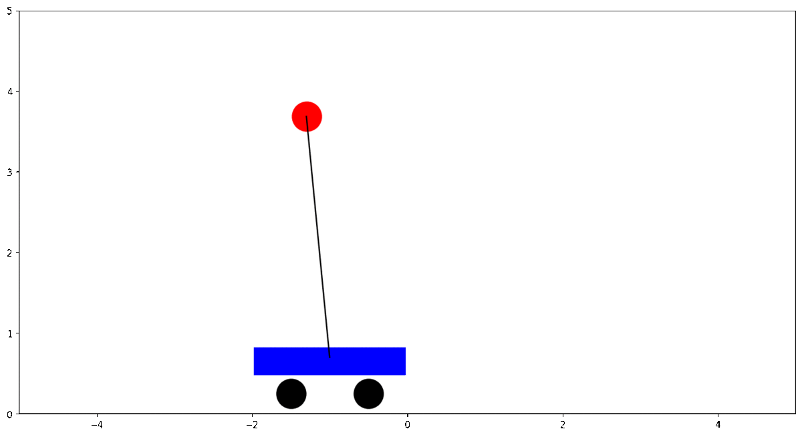
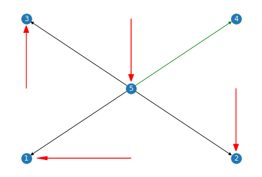

# Controllability of Complex Networks

# Control theory

# Networks
> To avoid the brute-force search for driver nodes, we proved that the
minimum number of inputs or driver nodes needed to maintain full
control of the network is determined by the ‘maximum matching’ in
the network, that is, the maximum set of links that do not share start
or end nodes. A node is said to be matched if a link in the
maximum matching points at it; otherwise it is unmatched. [..] the structural controllability
problem maps into an equivalent geometrical problem on a network:
we can gain full control over a directed network if and only if we
directly control each unmatched node and there are directed paths
from the input signals to all matched nodes. [5]

## Notebooks
- [Inverted pendulum on a cart](./notebooks/00_inverted_pendulum_on_a_cart.ipynb)
- [Controlling a line network](./notebooks/01_line-network.ipynb) 
- [Dynamical Mode Decomposition on networks](./notebooks/02_dynamical_mode_decomposition.ipynb)
g

## References
[1] Brunton, S., & Kutz, J. (2019). _Data-Driven Science and Engineering: Machine Learning, Dynamical Systems, and Control._ Cambridge: Cambridge University Press. doi:10.1017/9781108380690  
[2] Brunton, S, (2017). _Linear Quadratic Regulator (LQR) Control for the Inverted Pendulum on a Cart [Control Bootcamp]_, https://www.youtube.com/watch?v=1_UobILf3cc  
[3] Sutton, R. S. & Barto, A. G. (2018 ), _Reinforcement Learning: An Introduction_, The MIT Press.  
[4] Liu, Y. Y. & Barabasi, A. L. (2016), _Control Principes of Complex Networks_, 10.1103/RevModPhys.88.035006  
[5] Liu, Y. Y., Slotine, J. J. & Barabási, A. L. (2011), _Controllability of complex networks._ Nature 473, 167–173. https://doi.org/10.1038/nature10011   
[6] Baggio, G., Bassett, D.S. & Pasqualetti, F. (2021), _Data-driven control of complex networks._ Nat Commun 12, 1429. https://doi.org/10.1038/s41467-021-21554-0  
[7] Sun, Jie and Motter, Adilson E. (2013), _Controllability Transition and Nonlocality in Network Control_, https://link.aps.org/doi/10.1103/PhysRevLett.110.208701  
[8] Cornelius, S., Kath, W. & Motter, A. (2013), _Realistic control of network dynamics._ Nat Commun 4, 1942 . https://doi.org/10.1038/ncomms2939  
[9] Recht, B. (2018)_A Tour of Reinforcement Learning: The View from Continuous Control_, 1806.09460, https://arxiv.org/abs/1806.09460  